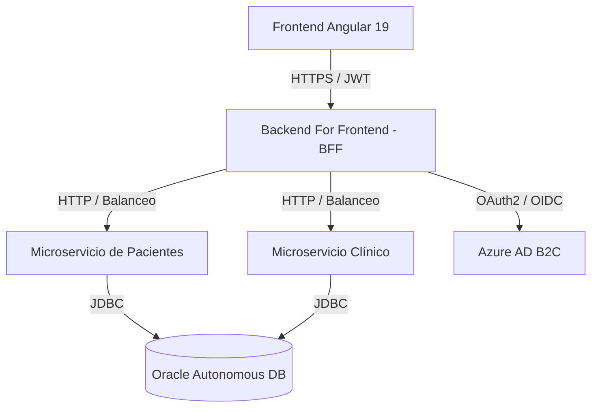

# Sistema de Alertas Médicas (Medical Alerts System) - DSY2206

Este proyecto es una plataforma moderna y distribuida para el monitoreo clínico de pacientes y la generación automatizada de alertas médicas en tiempo real. Está diseñado bajo una arquitectura de microservicios robusta, segura y escalable, utilizando tecnologías nativas de la nube y bases de datos gestionadas en el cloud.

## Arquitectura del Sistema

El sistema está compuesto por los siguientes componentes principales:



### Componentes:
1. **Frontend (Angular 19)**: Interfaz de usuario moderna y responsiva construida con Tailwind CSS. Permite a los profesionales de la salud visualizar pacientes, registrar signos vitales y gestionar alertas clínicas.
2. **Backend For Frontend (BFF)**: Microservicio en Spring Boot que actúa como punto único de entrada, agregador de servicios y capa de seguridad. Valida los tokens de acceso provistos por Azure AD B2C.
3. **Microservicio de Pacientes (patients-ms)**: Servicio Spring Boot encargado de gestionar el ciclo de vida de los datos demográficos y clínicos básicos de los pacientes.
4. **Microservicio Clínico (clinical-ms)**: Servicio Spring Boot encargado del registro de constantes vitales (frecuencia cardíaca, presión arterial, temperatura, etc.) y la detección automática de umbrales anómalos para disparar alertas médicas.
5. **Base de Datos**: Instancia en la nube de Oracle Autonomous Database (ADB), garantizando persistencia relacional con altos estándares de seguridad y alta disponibilidad.

---

## Tecnologías Utilizadas

- **Backend**: Java 17, Spring Boot, Spring Security (OAuth2 Resource Server), Spring Data JPA, Oracle JDBC Driver.
- **Frontend**: Angular 19, TypeScript, Tailwind CSS, MSAL (Microsoft Authentication Library) para la integración con Azure.
- **Base de Datos**: Oracle Cloud Autonomous Database.
- **Autenticación**: Azure Active Directory B2C (OIDC / OAuth2).
- **Contenedores y Despliegue**: Docker, Docker Compose.

---

## Estado del Proyecto

- **Backend**: Microservicios e infraestructura de BFF integrados completamente. Seguridad configurada con JWT y validación contra Azure AD B2C. Gestión de excepciones estandarizada mediante RFC 7807 (Problem Details).
- **Frontend**: Interfaz gráfica modernizada, localizada en español y adaptada para diferentes dispositivos. Integración con el BFF para consumir de forma segura todos los recursos del paciente.
- **Persistencia**: Conectividad activa y segura con Oracle Autonomous Database en Oracle Cloud (Santiago) con pool de conexiones optimizado.

---

## Configuración y Despliegue

### Requisitos Previos
- **Docker y Docker Compose** instalados en el sistema.
- **Node.js 18+** y **npm** para el desarrollo del frontend.
- **Java 17** y **Maven** (si se desea compilar localmente fuera de contenedores).

### Pasos para Ejecutar el Proyecto

1. **Configurar las variables de entorno**
   Duplique el archivo `.env.example` en la raíz del proyecto, cámbielo de nombre a `.env` e ingrese las credenciales necesarias (base de datos Oracle Cloud, IDs de cliente de Azure AD B2C y rutas de emisor).

2. **Levantar los Microservicios de Backend**
   Ejecute el siguiente comando en la raíz del proyecto para construir las imágenes de Docker y levantar los contenedores:
   ```bash
   docker-compose up --build -d
   ```
   Esto iniciará los siguientes servicios:
   - `backend-bff` en el puerto `8080`
   - `patients-ms` en el puerto `8081`
   - `clinical-ms` en el puerto `8082`

3. **Ejecutar el Frontend**
   Navegue a la carpeta del frontend y levante el servidor de desarrollo local:
   ```bash
   cd frontend-angular
   npm install
   npm run dev
   ```
   *Nota: Por defecto, el servidor del frontend se iniciará en `http://localhost:4200`.*

---

## Estructura de Endpoints Principales (BFF)

Todos los consumos del cliente deben direccionarse al BFF (`http://localhost:8080`):
- **Pacientes**: `GET/POST/PUT/DELETE /api/patients`
- **Signos Vitales**: `GET/POST /api/vital-signs`
- **Alertas**: `GET/PUT /api/alerts`
